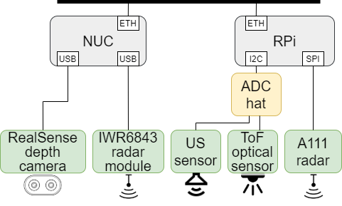
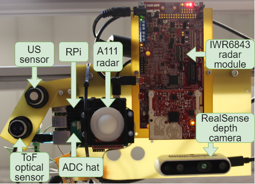
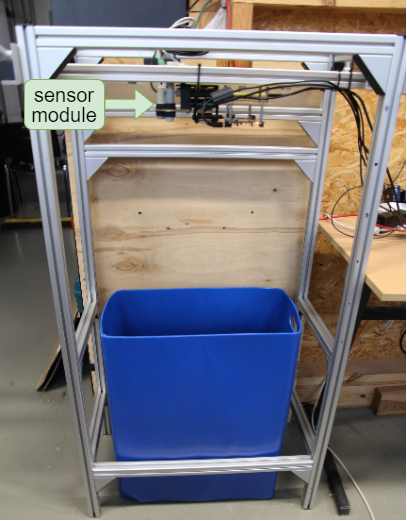
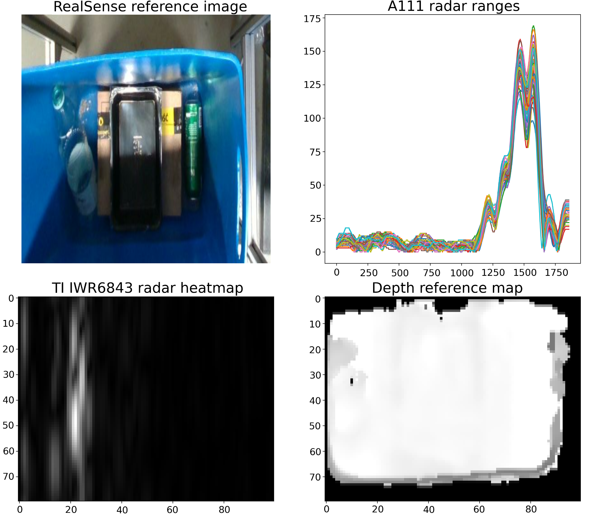
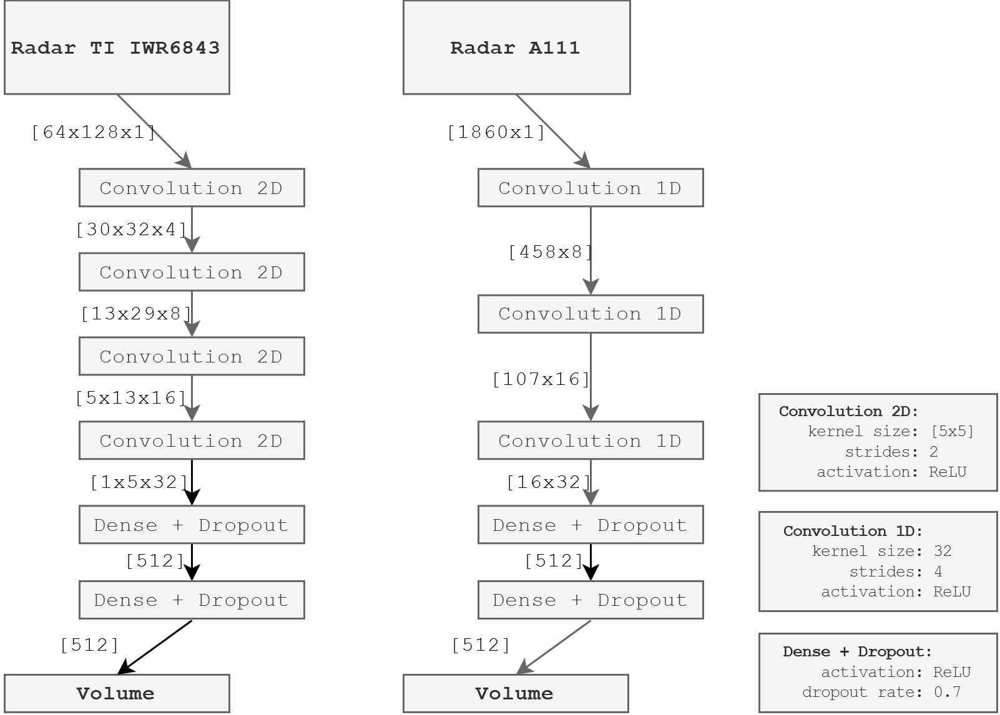

# volumetric
Dataset and code for volumetric estimation of non-structured heterogeneous waste. Supplement for [Automation 2021 paper](https://link.springer.com/chapter/10.1007%2F978-3-030-74893-7_31).

## How to use?

1. Unzip all files in `data` folder.
2. Run the script `volumeEstimation.py`.

## Measurement system description
Running several sensor in ROS to perform and record trash level detection in a bin.

Sensors:
- Radar TI IWR6843
- Radar A111
- Realsense D435i 
- Ultrasound sensor (legacy)
- ToF sensor (legacy)

Connected to Raspberry Pi 4:
- Radar TI IWR6843 -> via USB (RS 232)
- legacy sensors -> via ADC HAT board
- Radar A111 -> via SPI HAT board

Connected to PC (NUC):
- Realsense D435i (USB 3.0)

### Block diagram

### Sensor module photo

### Test station photo

### Data example

## Neural network training

Two approaches for neural network training were used:

1. Use object volume information as ground truth.
2. Use depth camera (RealSense) data as ground truth.

### Neural network architecture
The following architectures of neural networks were used for volume estimation from A111 and IWR6843 radars.

